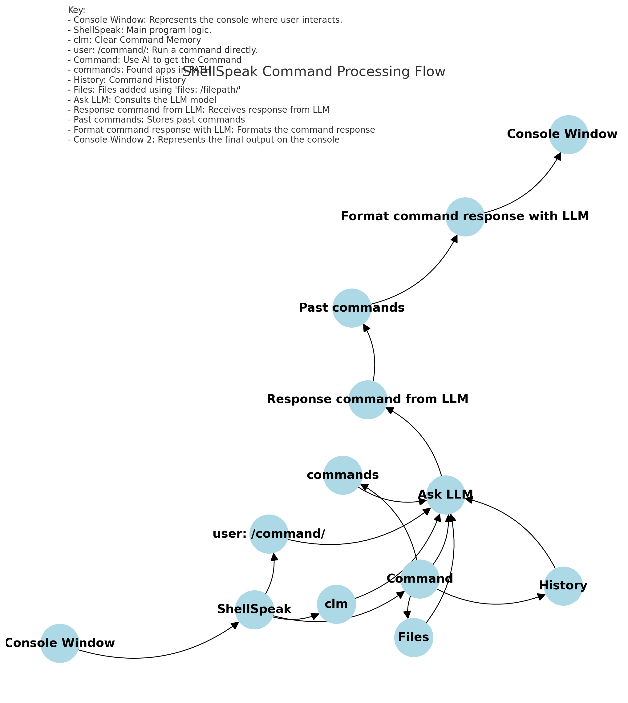

# ShellSpeak

ShellSpeak is an interactive command-line interface that enhances the terminal experience by integrating AI-driven command translation and execution. The core functionality of ShellSpeak revolves around capturing user input, translating it to actionable shell commands through an AI model, and executing these commands while displaying the output in a styled and user-friendly manner.

## Notice
- This can and will delete files if you are not careful, I suggest you use this on a ystem you do not care about, or a emulator.
- Feel free to look at what I have done, and please check back in a day or two.
- I plan on Expananding on this README this is just a quick draft.

## Information



The above diagram illustrates the architecture of ShellSpeak. It provides an in-depth look into how the program captures and processes user input to execute commands. We have recently added the capability to handle file inputs and to manage command history, enhancing the overall user experience.

## Setup

1. Clone the repository:
    ```bash
    git clone https://github.com/TheCompAce/ShellSpeak
    cd ShellSpeak
    ```

2. Install the required dependencies:
    ```bash
    pip install -r requirements.txt
    ```

3. Configure your settings in `settings.json` to match your preferences and system setup.

## Usage

Run the `ShellSpeak` script from the command line:
```bash
python main.py
```

## Contribute
- Check our Disscussion on our [GitHub Discussion](https://github.com/TheCompAce/ShellSpeak/discussions)
- You can join to help build the code base, or to mod the GitHub. (I do have another job, this is mainly for learning.)
- You can also donate (@BradfordBrooks79 on Venmo) if you want (I would love to do stuff like this full time.)

## License

ShellSpeak is licensed under the Apache License 2.0. See the [LICENSE](LICENSE) file for details.

